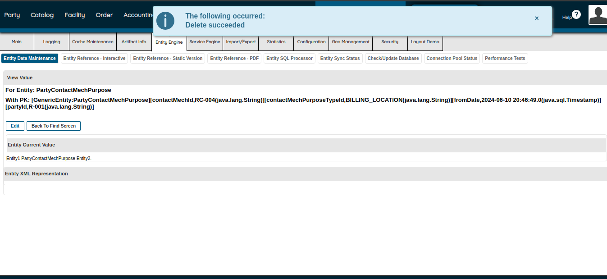

Party Data Model Assignments
Activity- 1 : Using PartyMgr:-

1.Create a person by name Mark Tailor

2.Assign Customer role to created person.

3.Change name of the person to Mark K Tailor

4.Add email address to customer profile

5.Add Billing phone to customer profile

6.Add Shipping phone to customer profile

7.Add Shipping Address to customer profile

8.Add Billing Address to customer profile

9.Make billing and shipping address same.

10.Change the purpose of billing address to General correspondence address

11.Delete(Expire) email address and create new

12.Delete(Expire) billing address and add new

13.Delete(Expire) shipping address and add new

Activity- 2 Using WebTools  

1.Create a person by name John Liston

2.Assign Customer role to created person

3.Change name of the person to John D Liston. 

4.Add email address to customer profile. 

5.Add Billing phone to customer profile. 

6.Add Shipping phone to customer profile.

7.Add Shipping Address to customer profile.

8.Add Billing Address to customer profile. 

9.Make billing and shipping address same. 

10.Change the purpose of billing address to General correspondence address. 

11.Delete(Expire) email address and create new.

12.Delete(Expire) billing address and add new.

13.Delete(Expire) shipping address and add new.

