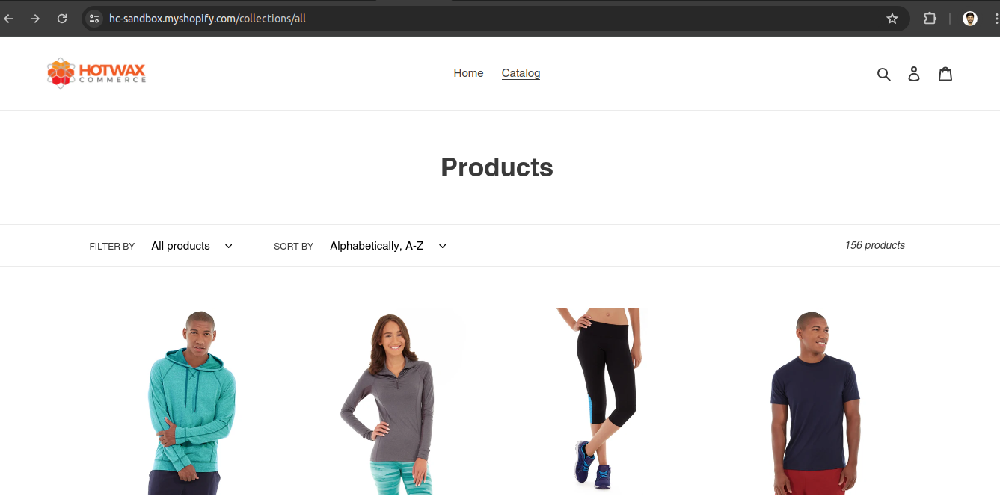

Order Lifecycle DEMO
Step - 1 Choose an item of your choice - https://hc-sandbox.myshopify.com/collections/all

Step 2 - Add the item to cart and check out , fill payment details and place order

Step 3 - Order has been created 

Step 4 - Open OMS and click on Order Management -> Sales Order - https://dev-oms.hotwax.io/commerce/control/FindOrder

Step 5 - If we don’t wish to wait for Brokering queue to run and assign a facility ,  we can do that manually 

Step 6 - Item has been brokered to a facility successfully 

Step 7 - Open fullfillment integration app of Hotwax commerce and click print picklist to assign a picker - https://fulfillment.hotwax.io/open

Step 8 - After assigning a picker , picklist is generated 

Step 9 - Pack the order for further process 

Step 10 - Click on ship now 

Step 11 - Confirm shipment by going to OMS 

